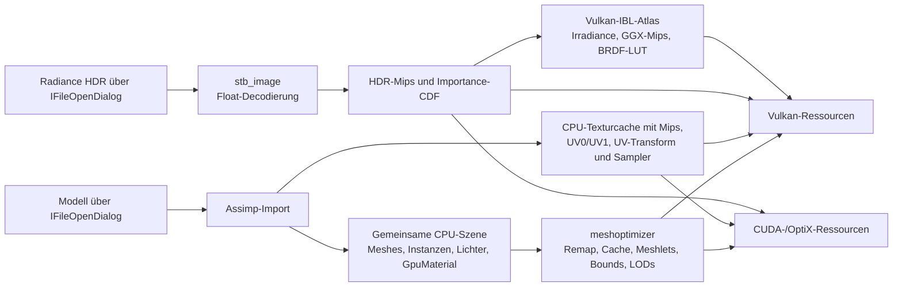
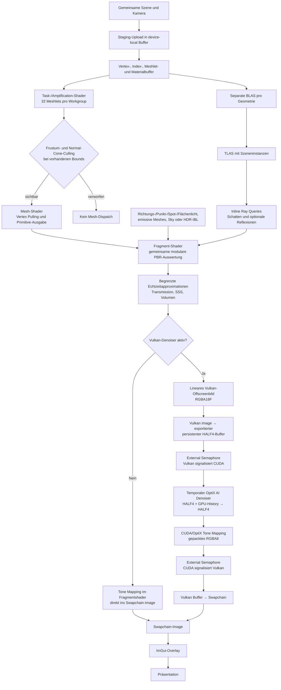
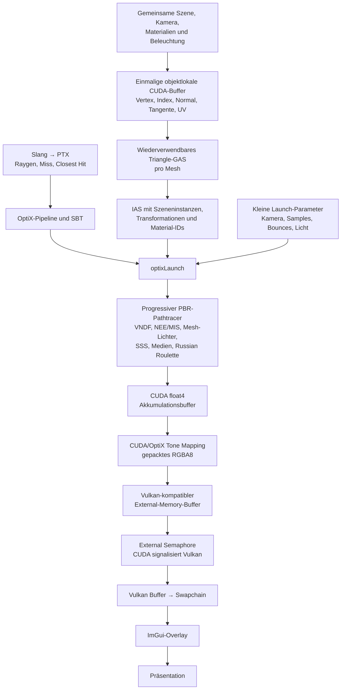
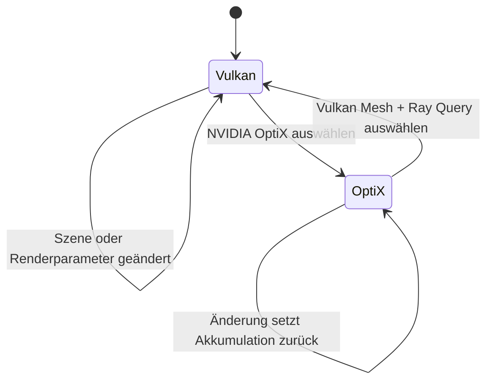

# Renderpfade

Diese Übersicht zeigt, welche Daten beide Backends teilen und wo sich Vulkan und OptiX unterscheiden. Die Diagramme verwenden Mermaid und werden in GitHub, Visual Studio Code und anderen Mermaid-fähigen Markdown-Ansichten direkt gerendert.

## Gemeinsame Asset-Aufbereitung

Die optionale meshoptimizer-Einstellung schaltet zusätzliche Remap-, Cache-, Overdraw-, Vertex-Fetch-, Bounds- und LOD-Verarbeitung. Die Meshlet-Partitionierung bleibt für den Vulkan-Mesh-Shader-Pfad immer aktiv.

## Vulkan: Mesh-Shader und Ray Queries

Wichtige Eigenschaften:

- Der Pfad erzeugt jeden Frame direkt und akkumuliert nicht progressiv.
- `Samples per frame` und `Max bounces` haben deshalb im Vulkan-Pfad keine Wirkung.
- HDR-Roughness wählt die GGX-vorgefilterte Atlasstufe und die Split-Sum-BRDF-LUT; das Environment überschreibt den Materialwert nicht.
- Ohne Denoiser rendert und tonemappt der Fragmentshader direkt ins Swapchain-Image.
- Mit Denoiser bleiben Denoising, Tone Mapping und Bildübergabe vollständig auf der GPU.
- Der temporale Modus verwendet vorherige Beauty- und interne Guide-Layer; Änderungen an Kamera, Szene, Licht, Material oder Auflösung invalidieren die History.
- Persistente External-Memory-Zuordnung und Semaphoren vermeiden CPU-Wartepunkte und Map/Unmap pro Frame.
- Materialfaktoren werden bei UI-Änderungen als einzelner 240-Byte-Bereich in den device-local Materialbuffer übertragen.
- Debugansichten greifen vor der Beleuchtung auf dieselben aufgelösten `SurfaceData` wie das Beauty-Rendering zu.

## OptiX: progressiver Pathtracer

Wichtige Eigenschaften:

- `Samples per frame` und `Max bounces` steuern nur diesen Pfad.
- Änderungen an Kamera, Szene, Licht oder Material setzen die Akkumulation zurück.
- SBT-Header werden beim Pipelineaufbau gepackt; pro Frame werden nur kleine Launch-Parameter aktualisiert.
- Der OptiX-Renderpfad verwendet keinen Denoiser.
- Die Ausgabe wird ohne synchrone Device-to-Host-Kopie oder CPU-Tone-Mapping direkt an Vulkan übergeben.
- HDR wird über eine zweistufige Luminanz-/Sinus-CDF importance-gesampelt; BSDF-, Environment- und emissive Dreieckslichter werden mit MIS kombiniert.
- Materialfaktoren aktualisieren nur einen GPU-Eintrag und setzen die Akkumulation zurück; Emissionsänderungen aktualisieren zusätzlich die Lichtverteilung.
- CUDA-Events messen den Launch asynchron, ohne den Renderpfad per `cuCtxSynchronize()` pro Frame zu blockieren.

## Backend-Wechsel

Vulkan besitzt in beiden Fällen die Swapchain und rendert das ImGui-Overlay. Dadurch bleibt die Oberfläche beim Backend-Wechsel erhalten und OptiX benötigt kein eigenes Präsentationssystem.
